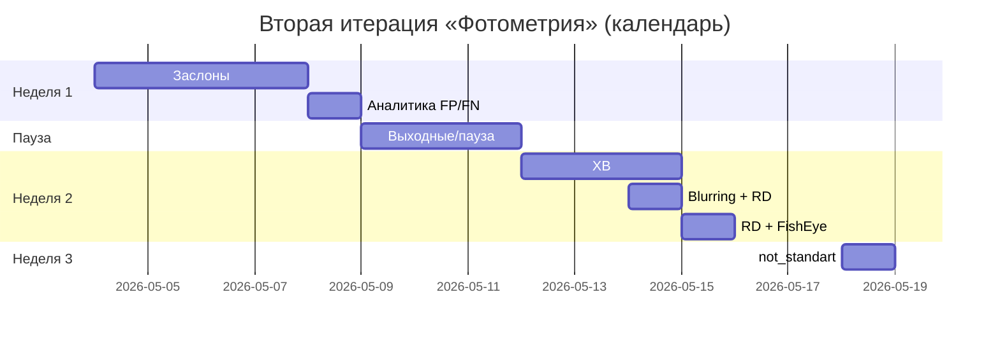

# Сводный отчёт по работе в DSM  
## Проект «Фотометрия», вторая итерация (обновление 19.05.2026)

**Период:** 04.05.2026 — 18.05.2026  
**Источники:** операционный отчёт DSM; срез по заслонам (Красногир В.А.); срез по редким заслонам (задача DS-800).

---

## 1. Краткое резюме для заказчика

За две недели активной работы (с перерывом 09–11.05) команда вела **сбор и разметку изображений** в DSM по **восьми направлениям (кейсам)** — от массового кейса «заслоны» до точечных сценариев (размытие, FishEye, нестандартное крепление).

| Показатель | Значение | Комментарий |
|---|---:|---|
| **Затрачено рабочего времени (основной поток)** | **79 ч** | По дневным табелям (без перерывов и времени загрузки страниц) |
| **Доп. срез: редкие заслоны** | **10–11 ч** | Чистое время сбора и проверки (отдельный учёт) |
| **Собрано изображений (итерация в целом)** | **30 531** | Все кейсы, календарный период |
| **Отобрано конструкций под датасет (итерация)** | **141** | Сумма по кейсам основного отчёта |
| **Просмотрено конструкций (итерация)** | **> 4 000** | Включая аналитику FP/FN 08.05 |
| **Пакет «заслоны» (финальный срез)** | **5 488 изображений**, **77 конструкций** | Кадры в разное время суток и погоду; см. разд. 4 |
| **Добор: редкие заслоны** | **229 изображений**, **8 конструкций** | Столбы, деревья, нестандартные объекты; см. разд. 5 |

---

## 2. Какие кейсы рассматривались

| Кейс | Суть | Когда в работе | Ключевые результаты |
|---|---|---|---|
| **Заслоны** | Провода, деревья, знаки и др. объекты, перекрывающие камеру (люди не входят) | 04–08.05, отдельные срезы | Основной объём недели 1; детализированный пакет 77 констр. / 5 488 кадров; добор редких случаев |
| **Аналитика FP/FN** | Выявление новых кейсов по ошибкам модели, таблица гипотез | 08.05 | > 1 000 просмотренных конструкций, 100 кадров |
| **XB** | Новый тип вертикальных рекламных конструкций | 12–14.05 | 12 342 изображения, 40 конструкций |
| **Blurring** | FP из‑за смаза (GID `UURD00001A1`) | 14.05 (0,5 ч) | 402 изображения, 1 конструкция |
| **RD** | Тип DSM «RW Вокзалы Digital» + буквы RD в GID; искажение полей при широком угле | 14–15.05 | 3 375 изображений, 14 конструкций (только со смещённой камерой) |
| **FishEye + фон** | Широкоугольная камера, много фона; SS — Суперсайды | 15.05 | 3 501 изображение, 20 конструкций |
| **not_standart / not_center** | Нестандартное расположение камеры; крепление слева/справа от центра | 18.05 | 4 441 изображение, 26 конструкций, 350 просмотрено |

### Описание кейсов (справочник)

| Кейс | Описание |
|---|---|
| **Заслоны** | Провода, деревья, дорожные знаки и другие объекты в кадре, перекрывающие обзор камеры. Люди к кейсу не относятся. |
| **XB** | Новый тип вертикальных конструкций рекламных щитов. |
| **Blurring** | Конструкция GID `UURD00001A1` регулярно попадает в FP из‑за смазанных/размытых изображений. |
| **RD** | В DSM — «RW Вокзалы Digital», в GID — буквы RD. При широком угле и ракурсе поля могут выглядеть как неработающие модули. В датасет — только конструкции со **смещённой камерой**. |
| **FishEye + фон** | Широкоугольная камера захватывает много фона; отбираются **наиболее нестандартные** фоны. Фиксируются конструкции **SS (Суперсайды)**. |
| **not_standart** | Нестандартное расположение камеры/конструкции. |
| **not_center** | Крепление конструкции справа или слева от центра. |

### Подтипы заслонов (детализация пакета «заслоны»)

| Подтип | Примечание |
|---|---|
| Ветки / стволы деревьев / кусты | — |
| Знаки ПДД | — |
| Висящие провода | На 3-й день сбор **намеренно сокращён** для разнообразия выборки; подготовлен список **57 GUID** мелких заслонов кабеля для возможного добора |

---

## 3. Затраченное время

### 3.1. Основной поток (табель по дням)

| Неделя | Дата | День | Часы | Кейс(ы) |
|---|---|---:|---:|---|
| №1 | 04.05.2026 | пн | 7 | Заслоны |
| | 05.05.2026 | вт | 8 | Заслоны |
| | 06.05.2026 | ср | 8 | Заслоны |
| | 07.05.2026 | чт | 8 | Заслоны |
| | 08.05.2026 | пт | 8 | FP/FN, таблица гипотез |
| №2 | 12.05.2026 | вт | 8 | XB |
| | 13.05.2026 | ср | 8 | XB |
| | 14.05.2026 | чт | 8 | XB (5) + Blurring (0,5) + RD (2,5) |
| | 15.05.2026 | пт | 8 | RD (2,5) + FishEye + фон (5,5) |
| №3 | 18.05.2026 | ср | 8 | not_standart, not_center |
| | **Итого** | | **79** | |

*Перерыв в календаре: 09–11.05 (рабочих записей нет). Время загрузки страниц и перерывы в табель не входят.*

### 3.2. Распределение часов по кейсам (основной поток)

| Кейс | Часы (оценка) |
|---|---:|
| Заслоны + аналитика заслонов (04–08.05) | 39 |
| XB | 21 |
| Blurring | 0,5 |
| RD | 5 |
| FishEye + фон | 5,5 |
| not_standart / not_center | 8 |

### 3.3. Отдельный срез: редкие заслоны

| Показатель | Значение |
|---|---:|
| Чистое время сбора и проверки | **10–11 ч** |
| Задача | [DS-800 в Shiva](https://shiva.imbalanced.tech/my-issues/44?keyword=DS-800) |

*Срез по редким заслонам может частично пересекаться по календарю с неделей 1; в табеле 79 ч он выделен отдельно исполнителем.*

---

## 4. Пакет «Заслоны» — детальный срез (Красногир В.А.)

Итоговая выгрузка по целенаправленной работе с заслонами на билбордах DSM:

| Показатель | Значение |
|---|---:|
| Обработано конструкций | **3 500** |
| Отобрано в датасет | **77** |
| Собрано изображений по отобранным | **5 488** |
| Условия съёмки | Разное время суток, погода, положение заслона |

**Хранение:** `s3://s3-data-science/krasnogir/DSM_04_05/заслон/`

**Добор по кабелям (при необходимости):**  
`//s3-data-science./krasnogir/DSM_0405/GUIDкабели.txt` — **57 GUID** конструкций с некрупными заслонами кабеля (список сохранён).

*Связь с основным отчётом: за 04–07.05 по кейсу «Заслоны» в табеле зафиксировано **6 470** кадров и **40** отобранных конструкций; пакет **5 488 / 77** — уточнённый и отфильтрованный результат для передачи заказчику (качество, разнообразие, повторные кадры).*

---

## 5. Добор: редкие заслоны (отдельный срез)

| Показатель | Значение |
|---|---:|
| Фокус | Столбы, деревья, необычные предметы в кадре |
| Обработано конструкций | **3 251** |
| Сохранено конструкций | **8** |
| Собрано изображений | **229** |
| Время (чистое) | **10–11 ч** |
| Трекинг | [Shiva DS-800](https://shiva.imbalanced.tech/my-issues/44?keyword=DS-800) |

---

## 6. Сводка по объёмам данных

### 6.1. Вся итерация (основной отчёт, 04–18.05)

| Показатель | Значение |
|---|---:|
| Собрано изображений | **30 531** |
| Отобрано конструкций | **141** |
| Просмотрено конструкций | **> 4 000** |

### 6.2. По кейсам (основной поток)

| Кейс | Изображения | Конструкции (отбор) | Просмотрено констр. |
|---|---:|---:|---:|
| Заслоны (04–07.05) | 6 470 | 40 | 3 000 |
| FP/FN / гипотезы (08.05) | 100 | — | > 1 000 |
| XB | 12 342 | 40 | — |
| Blurring | 402 | 1 | — |
| RD | 3 375 | 14 | — |
| FishEye + фон | 3 501 | 20 | — |
| not_standart / not_center | 4 441 | 26 | 350 |
| **Сумма по табелю** | **30 631*** | **141** | **> 4 350** |

\*Небольшое расхождение с итогом **30 531** в исходном отчёте (±100) — при сверке использовать **30 531** как официальный итог итерации.

### 6.3. Специализированные выгрузки (не суммировать с 30 531 без уточнения)

| Выгрузка | Изображения | Конструкции | Назначение |
|---|---:|---:|---|
| Пакет «заслоны» (S3) | 5 488 | 77 | Передача заказчику, разнообразие условий |
| Редкие заслоны (DS-800) | 229 | 8 | Дополнение редкими типами заслонов |

---

## 7. Хронология и логика работ

**Логика этапов:**

1. **Неделя 1** — массовый сбор по заслонам и переход к аналитике ошибок модели для планирования следующих кейсов.  
2. **Неделя 2** — новый тип XB, затем точечные проблемы качества (Blurring, RD) и сложный фон (FishEye).  
3. **Неделя 3** — геометрия установки (not_standart, not_center).  
4. **Параллельно / уточняющие срезы** — финальный пакет заслонов (77 констр.) и добор редких заслонов (8 констр.).

---

## 8. Что важно для заказчика

| Тема | Детали |
|---|---|
| **Покрытие сценариев** | 8 направлений + 3 подтипа заслонов; учтены FP/FN для планирования |
| **Качество заслонов** | Кадры при разной погоде и времени суток; контроль разнообразия (сокращение сбора проводов в день 3) |
| **Ограничения RD** | В датасет только конструкции со смещённой камерой |
| **FishEye** | Приоритет нестандартного фона, тип SS |
| **Артефакты** | S3-пакет заслонов; список 57 GUID для добора кабелей; задача DS-800 для редких заслонов |
| **Трудозатраты** | **79 ч** основной итерации + **10–11 ч** среза по редким заслонам (при необходимости полного бюджета — ориентир **~89–90 ч**, с уточнением пересечений по исполнителям) |
| **Риски / добор** | 57 GUID кабелей — резерв; редкие заслоны — 8 конструкций (потенциал расширения) |

---

## 9. Приложение: исходные фрагменты отчётов

Данный документ объединяет:

1. **Операционный отчёт DSM** (обн. 19.05.2026), период 05.05–18.05 (+ 04.05 в неделе 1).  
2. **Срез «Заслоны»** — Красногир В.А., 3 500 → 77 конструкций, 5 488 кадров, S3.  
3. **Срез «Редкие заслоны»** — 3 251 обработано, 229 кадров, 8 конструкций, DS-800.

---

*Документ подготовлен для передачи заказчику. При вопросах по двойному учёту часов или изображений между срезами — уточнить пересечение исполнителей и календарных дат.*
